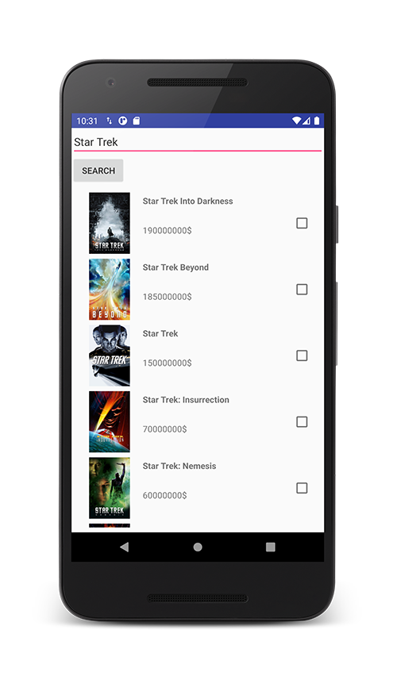

# MovieBudget application uses themoviedb.org API to fetch information about movies or series.

This project's main purpose is to demonstrate the MVP pattern with dependency injection in Android environment with a minimal UI.

Request your apy key here: https://developers.themoviedb.org/3

Used libraries: 
- AndroidX
- Retrofit
- Okhttp3
- Gson
- Chuck network debug
- RxJava
- Room
- Dagger2
- ButterKnife
- Glide

Sample image of the application: 

