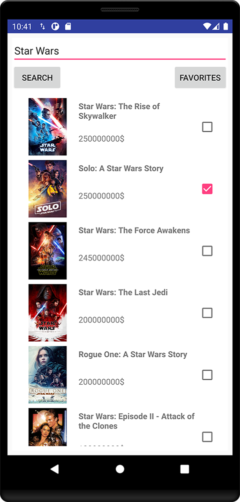

# MovieBudget application

This project's main purpose is to demonstrate the MVP pattern with dependency injection in Android environment with a minimal UI.

The app has 2 screens:

1. Search page: which has a text input, where the users can type a word which is a full or a part of a movie title. After clicking on search button, the application fetches 3 pages of matching movies from the "TheMovieDb" and shows it in a list  - listitem: title, price, cover image, checkbox -  to the user ordered by price, and highest price first. On the result list the user can mark movies as favorites (with a tick mark) and these favorites should be remembered and indicated in case the movie is presented again. The user can also remove movie(s) from favorites by unticking the item from the search wiew.

2. Favorite page: which lists the favorite movies in a list, ordered by title.

The MovieBudget application uses themoviedb.org API to fetch information about movies or series.
Request your api key here: https://developers.themoviedb.org/3

Used libraries: 
- AndroidX
- Retrofit
- OkHttp3
- Gson
- Chuck network debug
- RxJava
- Room
- Dagger2
- ButterKnife
- Glide

Sample image of the application: 

